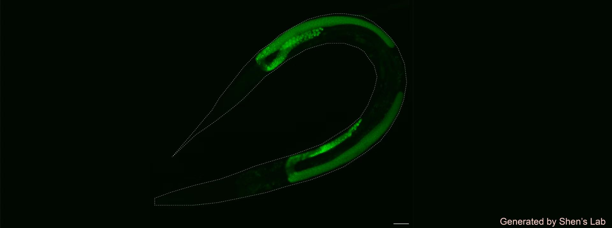
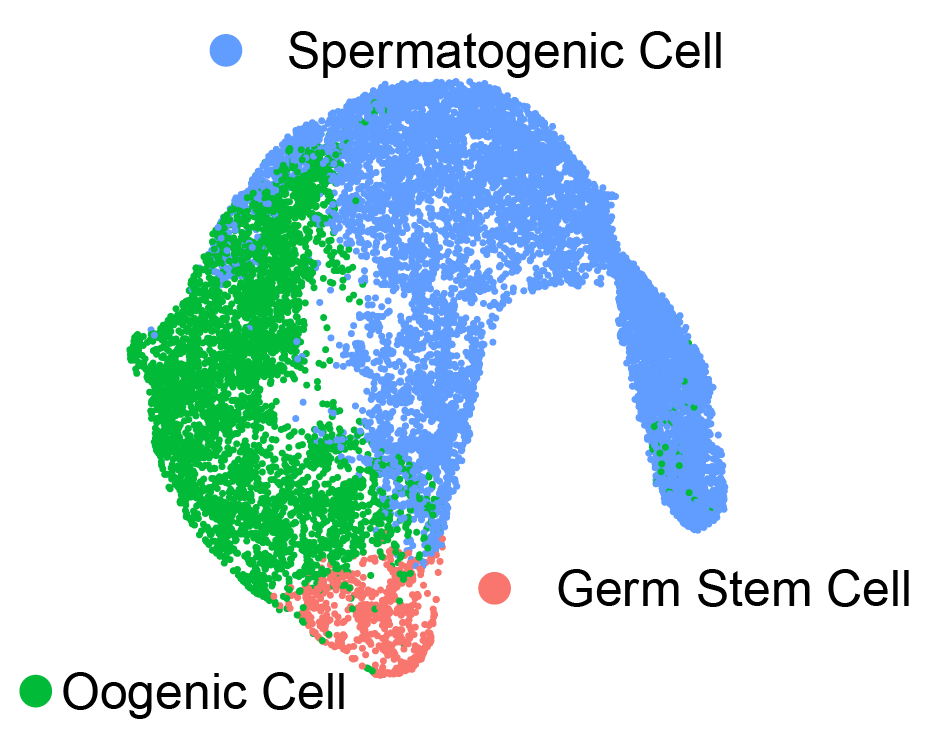

# SCGerm-Atlas

This repository contains the source code for building a **Single-Cell Gene Expression Profiling Visualization Server** for **SCGerm-Atlas**.

## **Introduction**

The SCGerm-Atlas project aims to provide an interactive and user-friendly platform for exploring the single-cell transcriptional atlas of the **C. elegans L4 stage germline**. The platform allows researchers to easily explore and analyze gene expression patterns, with the following key features:

- **Gene Expression Exploration**: Users can query the platform to visualize gene expression patterns in the L4 germline.
- **Spermatogenesis Atlas**: An atlas of gene expression during spermatogenesis is available for further insights.
- **Transcription Factor (TF) Regulation**: The platform also illustrates the relationships between **transcription factors (TFs)** and genes during spermatogenesis, helping users understand the regulatory roles of TFs in this process.

Overall, SCGerm-Atlas presents a comprehensive, single-cell resolution transcriptional map of the **C. elegans** germline.

## **Screenshot**

## **Demo**

Explore the demo visualizations of L4 stage data:

# **Dependencies**
- **PHP version: 8.1.0**
- **mysql version: 8.0.41-0ubuntu0.22.04.1 for Linux on x86_64 ((Ubuntu))**
- **nginx version: nginx/1.18.0 (Ubuntu)**
- **python: Python 3.11.11**
